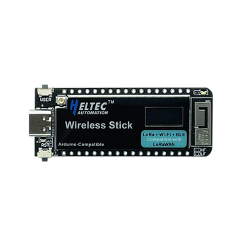
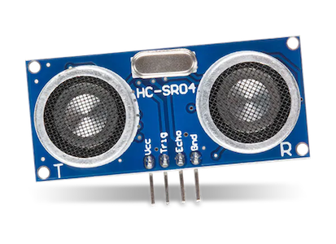
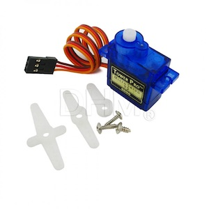
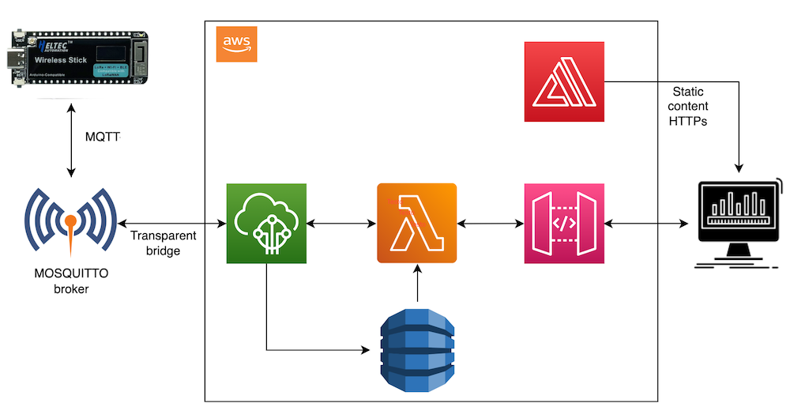

# smartDustBin
Individual project for the course "IoT: algorithms and services" at Sapienza Università di Roma Engineering in Computer Science master degree.

- [Personal Linkedin profile](www.linkedin.com/in/simone-pascucci-17751126b/](https://www.linkedin.com/in/simone-pascucci-17751126b/)

## Brief description

The Smart Dust Bin project is an innovative IoT solution that combines the power of the ESP32 microcontroller, RIOT OS (Operating System for the Internet of Things), and the AWS (Amazon Web Services) ecosystem. The project aims to create an intelligent waste management system with real-time monitoring, data analysis, and a user-friendly web interface.

## Concept

The core concept behind the project is to create a dust bin that autonomously detects nearby objects and opens its lid automatically. This eliminates the need for manual lid operation, offering a hygienic and convenient experience for users. The ESP32 board serves as the central control unit, efficiently processing sensor data and managing the lid mechanism. Overall, the Smart Dust Bin project combines the ESP32 board, an ultrasonic sensor, a servo motor and intelligent software to create an advanced waste management system. With automated lid opening, it enhances user convenience, improves waste collection efficiency, and contributes to a cleaner and more sustainable environment other than improving hygenical aspects.

## Components

### ESP32v3 board and RiotOS

The ESP32v3 board is a powerful microcontroller board featuring the ESP32 chip, renowned for its versatility and capabilities. With built-in Wi-Fi and Bluetooth connectivity, ample processing power, and a rich set of I/O interfaces, the ESP32v3 board is an ideal choice for IoT projects, robotics, and advanced embedded systems. It offers an extensive range of functionalities and supports various programming frameworks, making it a reliable and flexible solution for diverse applications.
RIOT OS is a lightweight operating system designed specifically for the Internet of Things (IoT), offering low memory footprint and energy-efficient operation. It is valuable for IoT applications as it provides a reliable and scalable platform for managing IoT devices, facilitating seamless communication, and optimizing resource utilization.

### Ultrasonic sensor HC-SR04

The HC-SR04 ultrasonic sensor is a popular distance measuring module used in various projects. It utilizes ultrasonic waves to accurately measure distances between objects and the sensor. In this project, the HC-SR04 sensor can be employed to detect the presence of objects near the smart dust bin, triggering the lid to open automatically. By providing precise distance measurements, it ensures efficient and timely lid operation, enhancing the convenience and usability of the system.

### Servo motor

The servo motor is a versatile actuator commonly used in projects requiring precise control of rotational motion. In your project, the servo motor serves the purpose of automatically opening the lid of the smart dust bin. By receiving control signals from the ESP32 board, it can rotate to a specific angle, allowing the lid to open smoothly. The servo motor adds a dynamic and automated functionality to the system, enhancing user experience.

### Mosquitto MQTT-Broker

Mosquitto is an open-source MQTT broker that facilitates lightweight messaging between devices in an IoT project. In this project, Mosquitto is used to enable efficient and secure communication between the smart dust bin and other components, such as the ESP32 board and the web interface, ensuring reliable data transmission and real-time updates.

### AWS Ecosystem

The Smart Dust Bin project leverages the power of the AWS ecosystem to enhance its functionality and capabilities. AWS IoT Core enables secure communication between the ESP32 board and the cloud, while Amazon DynamoDB provides efficient storage and retrieval of lid opening events and load measurements. AWS Lambda functions process real-time data, triggering automated actions. Amazon API Gateway offers a secure web interface for users to monitor and control the system, and AWS Amplify simplifies the development of a user-friendly application. Together, these services ensure seamless connectivity, real-time data analysis, controlled access, and an enhanced user experience for the smart dust bin project.
