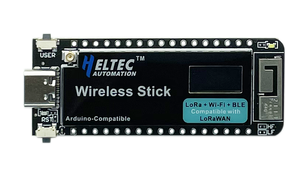

# smartDustBin
Individual project for the course "IoT: algorithms and services" at Sapienza Università di Roma Engineering in Computer Science master degree.

- [Personal Linkedin profile](https://www.linkedin.com/in/simone-pascucci-17751126b/)

## Brief description

The Smart Dust Bin project is an innovative IoT solution that combines the power of the ESP32 microcontroller, RIOT OS (Operating System for the Internet of Things), and the AWS (Amazon Web Services) ecosystem. The project aims to create an intelligent waste management system with real-time monitoring, data analysis, and a user-friendly web interface.

## Concept

The core concept behind the project is to create a dust bin that autonomously detects nearby objects and opens its lid automatically. This eliminates the need for manual lid operation, offering a hygienic and convenient experience for users. The ESP32 board serves as the central control unit, efficiently processing sensor data and managing the lid mechanism. Overall, the Smart Dust Bin project combines the ESP32 board, an ultrasonic sensor, a servo motor and intelligent software to create an advanced waste management system. With automated lid opening, it enhances user convenience, improves waste collection efficiency, and contributes to a cleaner and more sustainable environment other than improving hygenical aspects.

## Components

### ESP32v3 board and RiotOS

The ESP32v3 board is a powerful microcontroller board featuring the ESP32 chip, renowned for its versatility and capabilities. With built-in Wi-Fi and Bluetooth connectivity, ample processing power, and a rich set of I/O interfaces, the ESP32v3 board is an ideal choice for IoT projects, robotics, and advanced embedded systems. It offers an extensive range of functionalities and supports various programming frameworks, making it a reliable and flexible solution for diverse applications.
RIOT OS is a lightweight operating system designed specifically for the Internet of Things (IoT), offering low memory footprint and energy-efficient operation. It is valuable for IoT applications as it provides a reliable and scalable platform for managing IoT devices, facilitating seamless communication, and optimizing resource utilization.

### Ultrasonic sensor HC-SR04

The HC-SR04 ultrasonic sensor is a popular distance measuring module used in various projects. It utilizes ultrasonic waves to accurately measure distances between objects and the sensor. In this project, the HC-SR04 sensor can be employed to detect the presence of objects near the smart dust bin, triggering the lid to open automatically. By providing precise distance measurements, it ensures efficient and timely lid operation, enhancing the convenience and usability of the system.

### Servo motor

The servo motor is a versatile actuator commonly used in projects requiring precise control of rotational motion. In your project, the servo motor serves the purpose of automatically opening the lid of the smart dust bin. By receiving control signals from the ESP32 board, it can rotate to a specific angle, allowing the lid to open smoothly. The servo motor adds a dynamic and automated functionality to the system, enhancing user experience.

### Mosquitto MQTT-Broker

Mosquitto is an open-source MQTT broker that facilitates lightweight messaging between devices in an IoT project. In this project, Mosquitto is used to enable efficient and secure communication between the smart dust bin and other components, such as the ESP32 board and the web interface, ensuring reliable data transmission and real-time updates.

### AWS Ecosystem

The Smart Dust Bin project leverages the power of the AWS ecosystem to enhance its functionality and capabilities. AWS IoT Core enables secure communication between the ESP32 board and the cloud, while Amazon DynamoDB provides efficient storage and retrieval of lid opening events and load measurements. AWS Lambda functions process real-time data, triggering automated actions. Amazon API Gateway offers a secure web interface for users to monitor and control the system, and AWS Amplify simplifies the development of a user-friendly application. Together, these services ensure seamless connectivity, real-time data analysis, controlled access, and an enhanced user experience for the smart dust bin project.

### Design and functioning

The Smart Dust Bin is designed as follows. The ultrasonic HC-SR04 sensor is placed in the center of the front part of the bin, at half it's height. The lid of the bin has been divided in two section, one smaller glued to the top of the bin and one larger which can be opened and closed by the servo motor. The servo infact lays on the fixed part with its arm initially placed perpendicularly to the lid with a short wire glued to the other section. The bin is coded to work as follows: 
- Every two seconds the ultrasonic sensor makes his measurement.
- If it detects a value of the distance below the defined threshold of 15 cm the servo motor will open the lid. The lid will remain opened for 5 seconds. 
- Then the ultrasonic sensor takes another measurement and if the distance will be above 15 cm the lid will be closed, otherwise the lid will stay open for another 5 seconds waiting for the next measurement. 

Every time the sensor detects a distance below the threshold or the servo motor changes its position the ESP32 board will send a message to the mosquitto MQTT broker which will forward the message to AWS IoT Core thanks to a transparent python bridge. The message will contain the informations that will be displayed on the web interface, such as the date time, the detected distance and the actuale state of the lid. The sampling period of two seconds is dued to a compromise within the power consumption and an acceptable responsiveness of the of the model. The 5 seconds period in which the lid will stay open has been chosen because this seems to be the minimum time needed for a person to throw away the uneeded stuff. The threshold has been defined to be of 15 cm because a smaller distance would have been uncomfortable for the user, while a bigger one could have led to useless openings of the lid due to the detection of normal objects moving around the bin.
The following image represents a picture of the prototype of the Smart Dust Bin project made by me.

### Hands-On Walkthrough

#### 1. Get RiotOS
- Install RiotOS and all its dependencies on your machine by following the instructions in the [official repo](https://github.com/RIOT-OS/RIOT) of the operating system. I suggest to install everything on an Ubuntu machine.

#### 2. Create a new Riot application
- Go into the examples folder under the Riot base directory.
- Create a new folder and call it "smartDustBin"
- Paste into the just created folder the files that are into the "code" folder of this repository

#### 3. Install and configure Mosquitto
- Download and install the mosquitto MQTT-Broker following the instructions at [this link](https://mosquitto.org/download/)
- Go into the installation folder (On Ubuntu it's "etc/mosquitto/") and create a new file called "mosquitto.conf" and paste the following lines into it:
- - allow_anonymous true
- - listener 1883

#### 4. Connection to AWS
Create an AWS account if you don't own one.

#### 4.1 IoT Core
- [Connect a new thing](https://eu-west-3.console.aws.amazon.com/iot/home?region=eu-west-3#/home) following the instructions given by AWS and download the SDK package on your pc.
- Go into "Things" and click on your thing and then go into "Certificates" section. Connect the policy that is under SDK folder downloaded in the previous step and edit the active version as follows: Add the following 5 lines in the JSON document of the policy. The first two under the "Publish" action in the "Resource" section, the following two under "Subscribe" and the last one under "Connect".
- - "arn:aws:iot:eu-west-3:477201098489:topic/dustbin"
- - "arn:aws:iot:eu-west-3:477201098489:topic/dustbin/data"
- - "arn:aws:iot:eu-west-3:477201098489:topicfilter/dustbin"
- - "arn:aws:iot:eu-west-3:477201098489:topicfilter/dustbin/data"
- - "arn:aws:iot:eu-west-3:477201098489:client/ESP32"
- Go into message routing section in the side menu and then into Rules to create a new rule called "dustbinRule" and click on the next button.
- SELECT * FROM 'dustbin/data'
- Choose DynamoDBv2 and then create a new table called "dustbinTable" with "timestamp" as partition key attribute.
- Go back to the rule settings, select the just created table and create a new IAM role "user" and select it.
- Complete the rule creation.

#### 4.2 Lambda
- [Create a new python](https://eu-west-3.console.aws.amazon.com/lambda/home?region=eu-west-3#/discover) Lambda function, name it "getDustBinData" and paste the code of the same named python script included in this repository.
- Save changes and deploy your function, if you want you can test it by clicking on "Test" button an creating a test event.

#### 4.3 API Gateway
- [Create a new REST API](https://eu-west-3.console.aws.amazon.com/apigateway/main/apis?region=eu-west-3) called "dustbinAPI".
- Click on "Options" into the resource section and create a new "GET" method.
- Be sure to paste the ARN of your lambda function where requested and
- Then under the options click on "Enable CORS" and enable it.
- Finally click on deploy API, select "New phase" and call it "dev". Now you obtained the URL of the API needed in the web app javascript file.

#### 4.4 Amplify
- [Create a new App](https://eu-west-3.console.aws.amazon.com/amplify/home?region=eu-west-3#/), call it "dustbinAPP".
- Choose the option to implement without a git provider.
- Rename the enviroment to "dev" and drag and drop the folder of the web application of the project.

### Web Dashboard

## Video demonstration
-

## Hackster.io article
- [Project blog entry on Hackster](https://www.hackster.io/simonepascucci/smart-dust-bin-with-riotos-and-esp-32-v3-5eb491)
